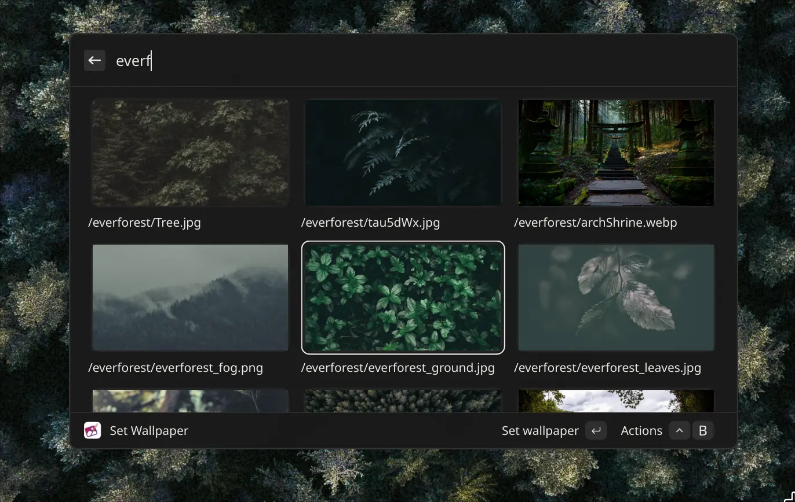

# Vicipaper - Wallpaper extension for Vicinae

<div style="display: flex; justify-content: center; align-items: center;">
    
</div>

This is a [Vicinae](https://github.com/vicinaehq/vicinae) extension that allows you to set a wallpaper using a custom command. It *should* be compatible with Raycast, but it has not been tested.

## Screenshot

<div style="display: flex; justify-content: center; align-items: center;">
    
</div>

## Installing

Clone this repository and go to the project root. From there, run

```bash
npm install
npm run build
```

To run the extension in dev mode, run:

```bash
npm install
npm run dev
```

*note*: Bun can also be used, and is what I used during development. However, the Vicinae documentation only cites npm, so be careful about using any other package manager.

## Usage

Run the [Deeplink](vicinae://extensions/Matis_Olives/wallpaper/wallpaper-setter) `vicinae://extensions/Matis_Olives/wallpaper/wallpaper-setter` with a bind on your desired window manager/compositor/desktop environment, or run the "Set Wallpaper" command in Vicinae. Fill the preferences, search and select the wallpaper to set!

### Actions

- "Set Wallpaper": sets the wallpaper
- "Copy Wallpaper path": copies the wallpaper's path to the clipboard.
- "Open Wallpaper": opens the wallpaper using your system's default application for the wallpaper's file type.
- "Show Wallpaper directory": opens the wallpaper's parent folder / directory using your system's default file browser.

## Preferences

| Name | Description                                                                                                         | Required/Optional | Default |
|------------|---------------------------------------------------------------------------------------------------------------------|-------------------|---------|
| Directory  | Set the directory in which wallpapers are stored                                                                    | Required          | N/A     |
| Command    | Set the command to run to apply the wallpaper. References to "%img" will be replaced with the path of the wallpaper | Required          | N/A     |
|  Recursive | Make the wallpaper search recursive                                                              | Optional          | False   |
| Columns    | Number of columns to display                                                                                        | Optional          | 3       |

### Example command

If using [Matugen](https://github.com/InioX/matugen), you can use a command similar to this:

```sh
matugen image %img% # %img% will be replaced by the image path
```

For [AWWW](https://codeberg.org/LGFae/awww), you could use something like this:

```sh
awww img %img%
```

*note*: AWWW's executable is still named `swww` in most package managers. Use `swww` or `awww` depending on which version you are using.

## Roadmap

- [x] Browse wallpapers from directory
- [x] Enable setting a custom command
- [x] Enable setting a custom number of columns for the grid
- [x] Enable recursive wallpaper search
- [x] Handle wallpaper setting logic
- [ ] Add metadata for each wallpaper
- [ ] Add caching
- [ ] Handle keyword based wallpaper search
- [ ] Add command to set a random wallpaper

## Additional notes

This project is distribution/desktop environment/compositor and wallpaper daemon/utility agnostic. Therefore, some features that would be available on some systems may not be supported by Vicipaper, or Vicipaper may support image formats that your system does not support.

For an example of an extension focused on a specific wallpaper daemon, see the [AWW Switcher extension](https://github.com/0x4c756e61/awww-switcher) (or its original repository for SWWW).